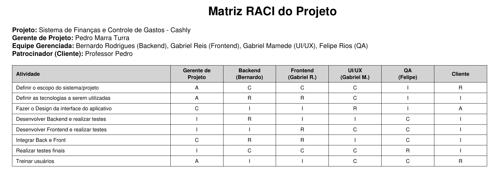

# Estrutura do Documento

- [Estrutura do Documento](#estrutura-do-documento)
- [Planejamento](#planejamento)
  - [Visão Geral do Planejamento](#visão-geral-do-planejamento)
  - [Escopo Detalhado (MVP)](#escopo-detalhado-mvp)
  - [Cronograma Resumido](#cronograma-resumido)
  - [Recursos e Papéis](#recursos-e-papéis)
  - [Orçamento e Aquisições](#orçamento-e-aquisições)
  - [Riscos e Mitigações](#riscos-e-mitigações)
  - [Critérios de Aceitação para o Planejamento](#critérios-de-aceitação-para-o-planejamento)
  - [Artefatos de Planejamento](#artefatos-de-planejamento)
- [Escopo do Projeto](#escopo-do-projeto)
- [Estrutura Analítica do Projeto](#estrutura-analítica-do-projeto)
- [Matriz de Responsabilidades](#matriz-de-responsabilidades)
- [Cronograma do Projeto](#cronograma-do-projeto)
    - [Documento Editável](#documento-editável)
- [Orçamento do Projeto](#orçamento-do-projeto)
    - [Documento Editável](#documento-editável-1)
- [Planos de Gerenciamento](#planos-de-gerenciamento)
  - [Plano de Qualidade](#plano-de-qualidade)
  - [Plano de Aquisição](#plano-de-aquisição)
    - [Documento Editável](#documento-editável-2)
  - [Plano de Riscos](#plano-de-riscos)

-----

# Planejamento

## Visão Geral do Planejamento
O objetivo desta fase é detalhar o escopo do MVP, estimar prazos e recursos, definir critérios de qualidade e preparar o plano de comunicação e gestão de riscos.

## Escopo Detalhado (MVP)

## Cronograma Resumido
- Semana 1: Iniciação e preparo do repositório, definição das tasks (issues).
- Semana 2 a 4: Implementação do backend e endpoints principais.
- Semana 5 a 7: Implementação do frontend e integração com backend.
- Semana 8: Testes, documentação e preparação para apresentação/entrega.

## Recursos e Papéis
- Desenvolvedores: implementação frontend/backend, testes.
- Revisor/QA: execução de testes de aceitação e verificação de critérios.
- Gerente/Coordenador (um dos alunos): controle de versões, integração contínua simples e entrega.

## Orçamento e Aquisições
- Itens previstos: servidores de teste (pode-se usar serviços gratuitos ou VM do departamento), eventuais licenças/softwares, material para apresentação.
- Procedimento: abrir Solicitação de Compra (documento em docs/) caso seja necessária aquisição.

## Riscos e Mitigações
- Risco: Falta de tempo para implementar funcionalidades completas.
  - Mitigação: priorizar backlog (MVP) e dividir trabalho em sprints curtos.
- Risco: Integrações externas demorarem ou não estarem disponíveis.
  - Mitigação: isolar integrações e fornecer mocks.
- Risco: Problemas de ambiente/infraestrutura.
  - Mitigação: usar contenção local (Docker) ou ambientes simples (SQLite) para protótipo.

## Critérios de Aceitação para o Planejamento
- Plano de projeto aprovado pelo orientador.
- Cronograma e entregáveis validados.
- Riscos identificados e plano de mitigação registrado.

## Artefatos de Planejamento
- Plano do projeto (este documento).
- TAP atualizado (se necessário).
- Backlog com prioridades e estimativas (pode ser mantido em issues do repositório).

# Escopo do Projeto

- Frontend: telas para login, dashboard com resumo financeiro, listagem de transações, formulário para criação/edição de transação.
- Backend: API REST para CRUD de transações, autenticação simples (token/session), armazenamento em banco de dados leve (SQLite / JSON para protótipo).
- Testes: testes unitários básicos e testes de integração para rotas críticas.

O código de referência e estrutura do projeto está em `src/` no repositório.

# Estrutura Analítica do Projeto

1. Iniciação
  - 1.1 Abertura do Projeto
    - 1.1.1 Definição do escopo inicial  
    - 1.1.2 Identificação das partes interessadas  
    - 1.1.3 Objetivos e justificativa  
  - 1.2 Resumo do Projeto
    - 1.2.1 Documento de visão  
    - 1.2.2 Levantamento preliminar de requisitos  
    - 1.2.3 Estruturação do cronograma inicial  

2. Planejamento
  - 2.1 Revisão dos requisitos
    - 2.1.1 Requisitos funcionais  
    - 2.1.2 Requisitos não funcionais  
    - 2.1.3 Regras de negócio  
  - 2.2 Arquitetura e tecnologia
    - 2.2.1 Escolha do stack  
    - 2.2.2 Estruturação inicial de diretórios  
    - 2.2.3 Definição de padrões de código  

3. Execução
  - 3.1 Configurar ambiente de desenvolvimento
    - 3.1.1 Preparar ambiente local  
    - 3.1.2 Configurar serviços externos  
    - 3.1.3 Integração com banco de dados  
    - 3.1.4 Configurar repositório e versionamento  
  - 3.2 Desenvolvimento das funcionalidades
    - 3.2.1 Implementação dos módulos principais  
    - 3.2.2 Implementação de serviços auxiliares  
    - 3.2.3 Criação das interfaces  
    - 3.2.4 Testar funcionalidades individuais  
  - 3.3 Integração
    - 3.3.1 Unificação dos módulos  
    - 3.3.2 Testes de integração  
    - 3.3.3 Preparação para entrega  

4. Encerramento
   - 4.1 Marco 3 – Projeto Concluído
     - 4.1.1 Revisão final  
     - 4.1.2 Entrega ao cliente  
     - 4.1.3 Documentação final  

# Matriz de Responsabilidades

A Matriz RACI é uma ferramenta de gestão de projetos que define claramente os papéis e responsabilidades dos membros da equipe em relação às atividades e entregas do projeto. RACI é um acrônimo que representa quatro tipos de responsabilidades: Responsável (Responsible), Aprovador (Accountable), Consultado (Consulted) e Informado (Informed). A matriz ajuda a evitar ambiguidades, garantindo que todos saibam quem é responsável por cada tarefa, quem deve aprovar decisões, quem precisa ser consultado para fornecer informações e quem deve ser mantido informado sobre o progresso do projeto.

# Cronograma do Projeto

O cronograma do projeto é uma representação visual e detalhada das atividades, marcos e prazos ao longo do ciclo de vida do projeto. Elaborado durante o planejamento, o cronograma é uma ferramenta que oferece uma visão das interdependências entre as tarefas, alocando recursos e definindo prazos para as entregas.

### Documento Editável

- [Cronograma e Orçamento do Projeto - Editável](artefatos/orçamento.pod)

# Orçamento do Projeto

O orçamento do projeto envolve a estimativa e alocação de recursos financeiros necessários para a execução bem-sucedida do projeto, abrangendo custos diretos e indiretos, despesas operacionais, investimentos em equipamentos, pessoal, entre outros.

### Documento Editável

- [Cronograma e Orçamento do Projeto - Editável](artefatos/orçamento.pod)

# Planos de Gerenciamento

Os planos de gerenciamento são documentos essenciais que delineiam as estratégias, processos e diretrizes para a execução eficaz do projeto. Eles abrangem diversas áreas, como qualidade, aquisições, comunicação e riscos, fornecendo uma estrutura clara para a equipe do projeto seguir ao longo do ciclo de vida do empreendimento.

## Plano de Qualidade

O Plano de Qualidade do projeto Cashly foca na garantia de um MVP robusto e funcional. As estratégias de qualidade incluem:
- **Testes Automatizados**: Implementação de testes unitários básicos e testes de integração para as rotas críticas da API REST.
- **Revisão de Código**: Todo código submetido passa por revisão (Pull Requests) para assegurar conformidade com os padrões definidos.
- **Testes de Aceitação**: O papel de Revisor/QA executará testes manuais baseados nos critérios de aceitação definidos para cada funcionalidade (Login, Dashboard, Transações) para validar a entrega.

[Checklist de Qualidade](artefatos/PlanoDeQualidade.pdf)

## Plano de Aquisição

O Plano de Aquisições do Cashly prioriza o uso de recursos gratuitos e ferramentas open-source para minimizar custos.
- **Recursos**: Utilização de camadas gratuitas (free tier) de serviços de hospedagem e banco de dados, ou máquinas virtuais (VM) disponibilizadas pela universidade.
- **Software**: Preferência por bibliotecas e frameworks gratuitos (React, Node.js/Python, SQLite).
- **Procedimento de Compra**: Caso surja uma necessidade excepcional (ex: licenças específicas), será aberta uma "Solicitação de Compra" formal, conforme modelo disponível nos artefatos do projeto.

### Documento Editável

- [Especificação Produto Aquisição](artefatos/SolicitacaoDeCompra.pdf)

## Plano de Riscos

O gerenciamento de riscos do Cashly identifica os principais desafios para a entrega do MVP e define estratégias de mitigação ativas:

| Risco | Mitigação |
|-------|-----------|
| **Falta de tempo** para implementar todas as funcionalidades desejadas. | Priorização estrita do backlog (foco no MVP: Login, Dashboard, CRUD Transações) e adoção de sprints curtos de desenvolvimento. |
| **Integrações externas** indisponíveis ou complexas. | Isolamento das camadas de integração e uso de "mocks" para não bloquear o desenvolvimento do frontend/backend. |
| **Problemas de infraestrutura** (ambiente de dev/prod). | Uso de containers (Docker) para padronizar o ambiente e bancos de dados leves (SQLite) para prototipagem rápida. |

- [Plano de Gerenciamento de Riscos](artefatos/levantamento_de_riscos.pdf)
